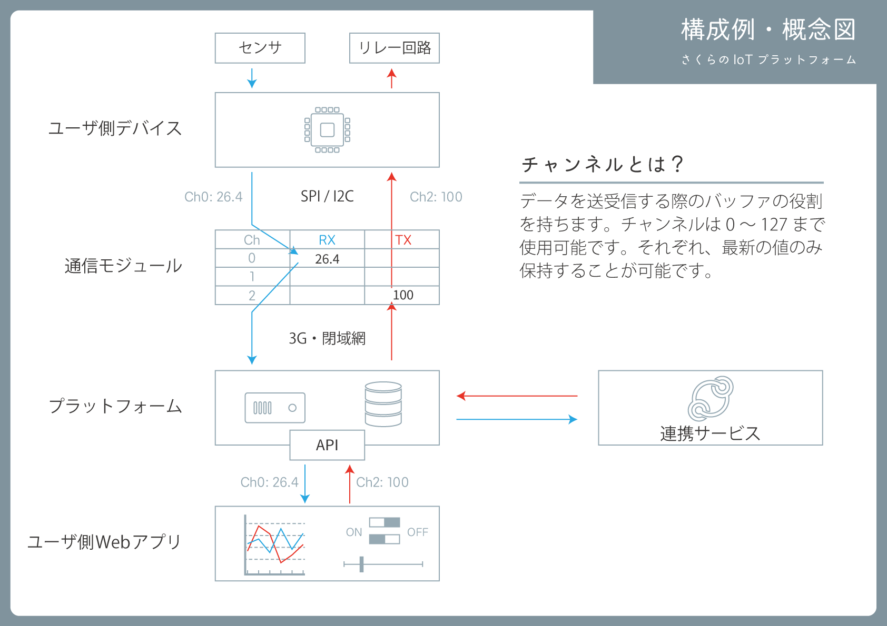

# プログラミングガイド

## さくらのIoT Platform αの概念



## フォーマット

### サンプル
※注意: このサンプルでは見やすいように改行してありますが、実際に送信する際は改行を含まないよう1行にまとめてください。

```
{
    "module": "hogehogehoge",
    "type": "channels",
    "datetime": "2016-06-01T12:21:11.628907163Z",
    "payload": {
        "channels": [{
                "channel": 1,
                "type": "i",
                "value": 1
            }
        ]
    }
}
```

### 型指定子
チャンネルの値の型を示す文字です。

|型|C言語における型|型指定子|
|:----|:--------------|:-------|
|符号あり32bit整数|int32_t|i|
|符号なし32bit整数|uint32_t|I|
|符号あり64bit整数|int64_t|l|
|符号なし64bit整数|uint64_t|L|
|32bit浮動小数点数|float|f|
|64bit浮動小数点数|double|d|
|8バイトの配列|byte[8]|b|


### 解説
基本的にモジュール→クラウド、クラウド→モジュールの両方向で同じデータ形式を使用します。

以下に実際のJSONとコメント(// 以降)を示します。

```
{
    "module": "hogehogehoge",    // 送信先モジュールIDを指定します
    "type": "channels",    // 現時点ではチャンネルデータの送受信にのみ対応しています。変更しないでください。
    "datetime": "2016-06-01T12:21:11.628907163Z",    // モジュールからデータを受け取った日時を表します。モジュールへデータを送信したい際には指定する必要はありません。
    "payload": {
        "channels": [ // 同時に複数チャンネルにデータを送信することが可能です
            {
                "channel": 1, // 送信先チャンネル
                "type": "i", // 型
                "value": 1 // データ
            },
            {
                "channel": 2, // 送信先チャンネル
                "type": "b", // 型
                "value": [11, 22, 33, 44, 55, 66, 77, 88] // データ
            }
        ]
    }
}
```

## 送信モード
複数の送信モードが用意されており、使い方によって送信モードを切替えることでデータ量の削減等に役立てることが出来ます。

|名称|値|解説|
|:---|:---|:---|
|送信停止モード|0x00|チャンネルに値が設定されても一切送信を行いません。|
|ワンショットモード|0x01|ワンショットモードに設定後、最初の1回のみチャンネルに設定された値を送信します。値の送信後は自動的に送信停止モードに遷移します。|
|自動送信モード|0x02|チャンネルに値が設定される度にデータを送信します。|
|それ以外|N/A|将来のために予約されています。設定しないでください。|

## 通信方式特有の事柄

### SPI

### I2C

### UART
当初シリアル通信でも上記通信方式と同じようなプロトコルで通信出来るようにする予定でしたが、いろいろあってシェルとして提供することになりました(あとで直す)

[さくらのIoT Platform α シェルリファレンス](./shell.md)
