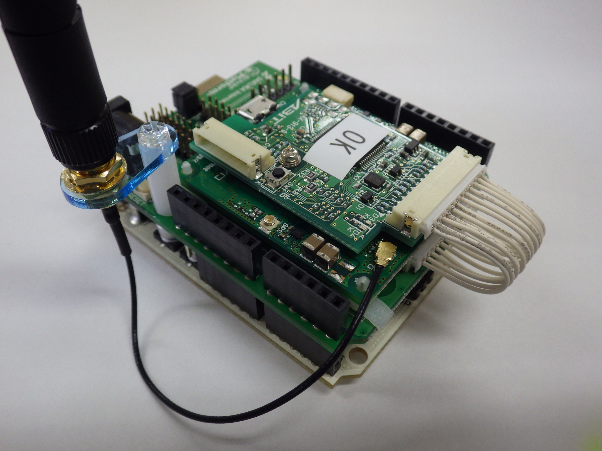
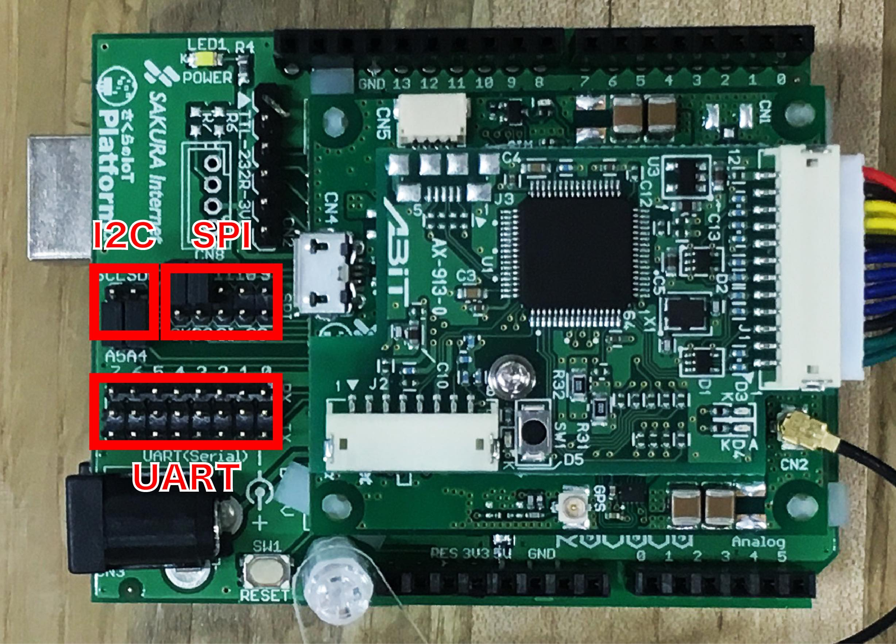
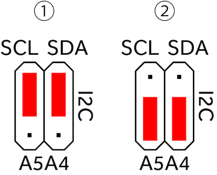
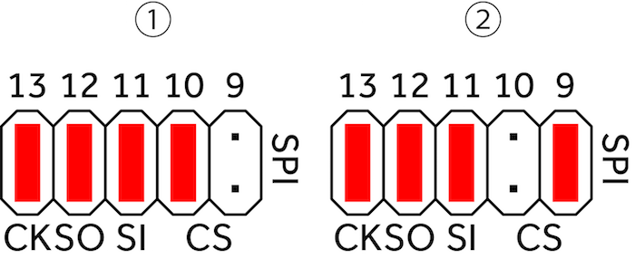

# Arduino向けシールド

## 最初に（注意事項）

Arduinoへ載せる前に、ジャンパーの設定を確認してください。
基本的にUART(Serial）は使用しませんので、ジャンパーを外してください。

Arduinoからの電源供給が不足する場合、通信が不安定になります。
その際は、シールド基板へACアダプターを接続してください。

ACアダプターは5V（2A程度）のものを使用してください。
プラグの形状は2.1φ、センタープラスです。
誤ったものを使用された場合、IoTモジュールやシールド基板が故障します。

シールドへACアダプタを接続すると、Arduinoへも電源が供給されますので、
Arduinoへ電源を接続する必要はありません。

[Arduino向けシールド回路図](./shield_schematic.pdf)

## 組み立て

さくらのIoT通信モジュールやアンテナは写真のように固定し配線します。

## ジャンパーの設定

### I2C

1. 上と中をショートすると、モジュールの I2C_SCL・SDA と、ArduinoのSCL・SDA を接続できます。
2. 下と中をショートすると、モジュールの I2C_SCL・SDA と、Arduinoのアナログ5・4を接続できます。

### SPI

ショートすることにより、モジュールのSPI_MOSI/MISO/SCK/CS と、Arduinoのデジタル13～11を接続できます。
SPIのCSは、Arduinoのデジタル9または10を選んで接続できます。

## UART

上と中をショートすると、モジュールの UART_RX と、Arduinoのデジタル0～7 を接続できます。
下と中をショートすると、モジュールの UART_TX と、Arduinoのデジタル0～7 を接続できます。
